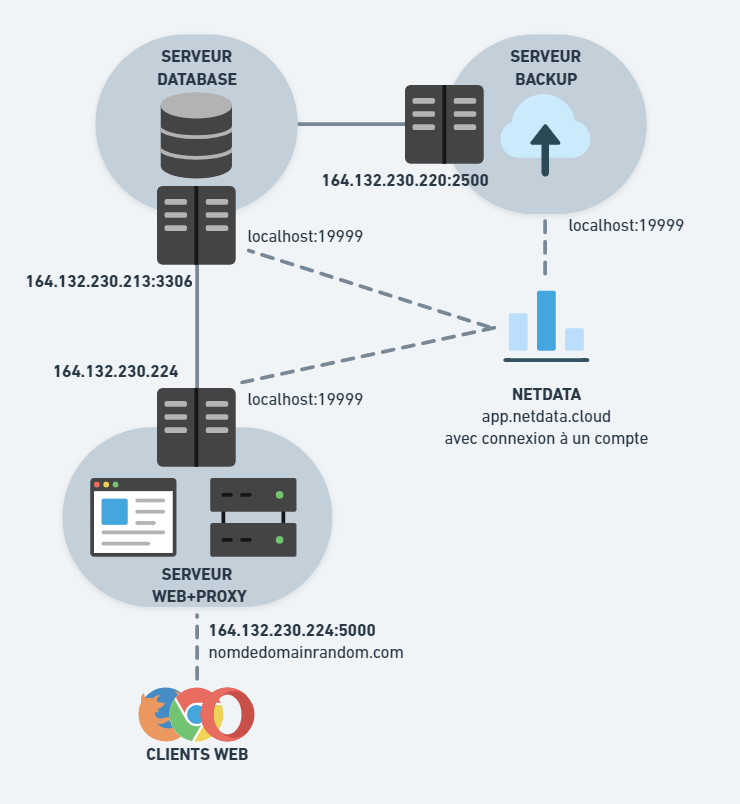

# Mise en place du serveur web
[Explication d'instalation du serveur web](./Markdown/Mise_en_place_du_serveur_web.md)

# Mise en place de la database
[Explication d'instalation du serveur de la base de donnée](./Markdown/Mise_en_place_de_la_base_de_donnees.md)

# Schéma réseau
Schéma réseau mis en place actuellement:

Schéma réseau mis en place sans restriction de budget:

# Utilisation de la solution

# Monitoring
[Explication du monitoring](./Markdown/Monitoring.md)

# Backup
[Explication de la backup mis en place](./Markdown/backup.md)